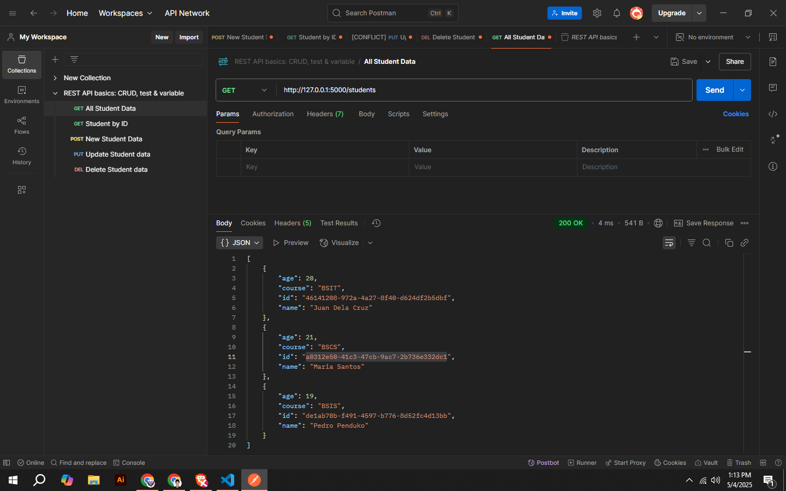
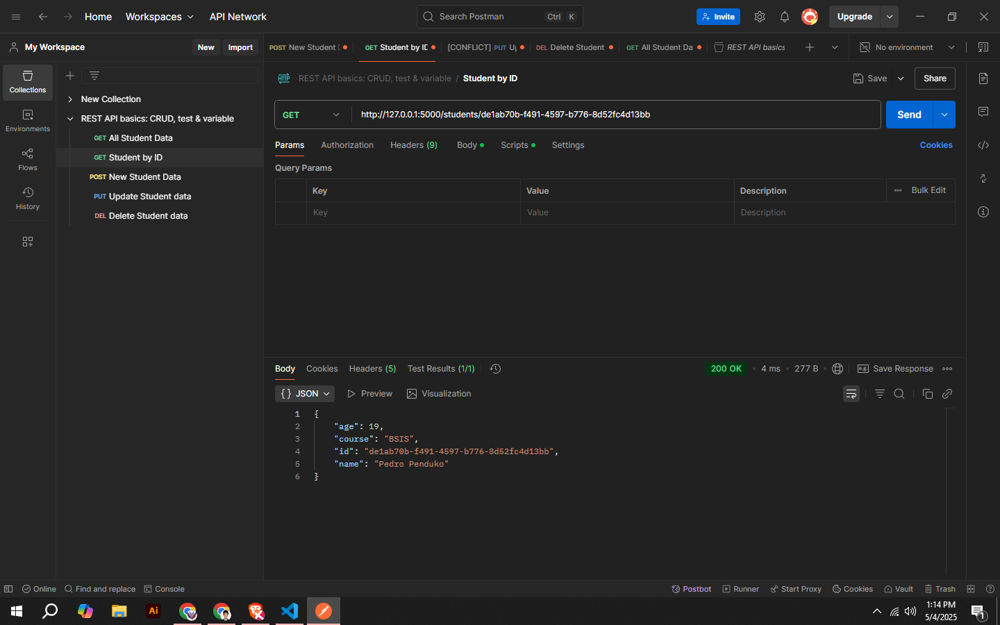
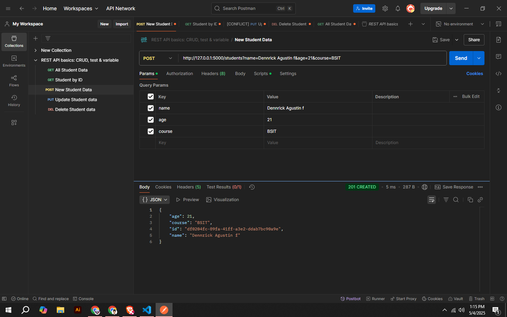
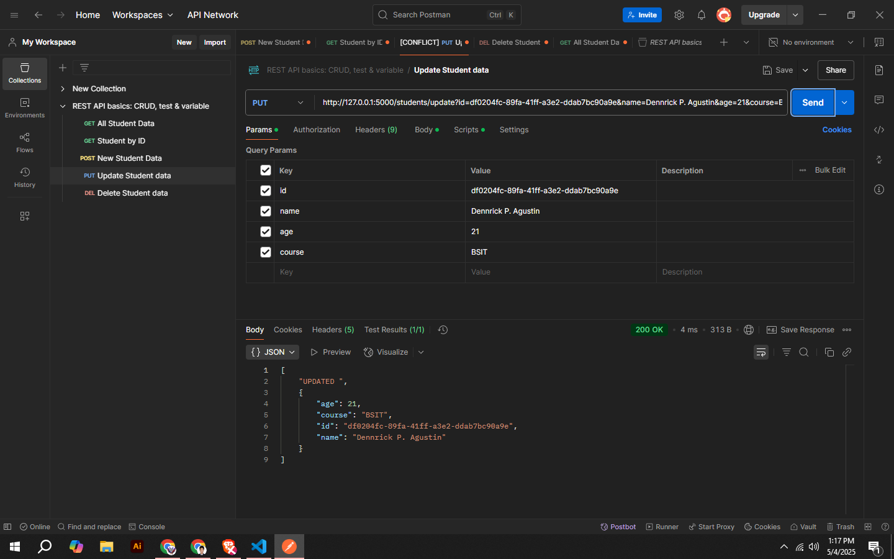
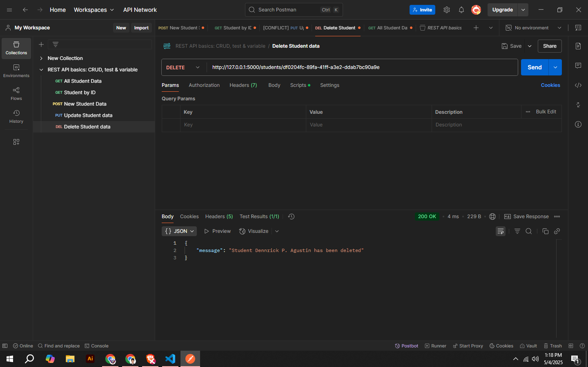

# Performance Task: Mini RESTful Web Service Development
## GROUP MEMBERS
- Dennrick P. Agustin
- Sevilla Ibanez
### Deploy Link

- Base URL
-- https://mini-res-tful-web-service-development.vercel.app
- Get JSON and all Students
-- https://mini-res-tful-web-service-development.vercel.app/students


## Student Record Management API

A simple RESTful API for managing student records built with Python Flask.
PS. this doesn't have a UI only A Return of JSON for API Testing Only

## Project Details

- **Technology Used:** Python Flask
- **Data Storage:** In-memory (data is lost when server is restarted)

## Setup Instructions

### Prerequisites
- Python 3.7+ installed
- pip (Python package installer)


### Screenshots
Get all Students


Get Student by ID


201 Created New Student


201 Created New Students this is for the deployed Version


Update Data


Delete Data Dennrick using ID



### Installation Steps

1. Clone this repository or download the source code
```bash
git clone https://github.com/Ekskie/-Mini-RESTful-Web-Service-Development.git
```

2. Create a virtual environment (optional but recommended)
```bash
python -m venv venv
```

3. Activate the virtual environment
   - On Windows:
   ```bash
   venv\Scripts\activate
   ```
   - On macOS/Linux:
   ```bash
   source venv/bin/activate
   ```

4. Install dependencies
```bash
pip install -r requirements.txt
```

5. Run the application
```bash
python app.py
```

6. The server will start at `http://127.0.0.1:5000/`

## API Endpoints

| Endpoint | Method | Description |
|----------|--------|-------------|
| `/students` | GET | Returns a list of all students |
| `/students` | POST | Adds a new student |
| `/students/:id` | GET | Returns details of a specific student by ID (path parameter) |
| `/students/:id` | PUT | Updates a student's details (path parameter) |
| `/students/update?id=<id>&name=<name>&age=<age>&course=<course>` | PUT/GET | Updates a student's details (query parameter) |
| `/students/:id` | DELETE | Deletes a student (path parameter) |

## API Usage Examples

### GET /students
Returns all students in the database.

**Request:**
```
GET http://127.0.0.1:5000/students
```

**Response:**
```json
[
  {
    "age": 20,
    "course": "BSIT",
    "id": "5f7c3a7e-8e42-4c9d-9dfe-40b312e7e478",
    "name": "Juan Dela Cruz"
  },
  {
    "age": 21,
    "course": "BSCS",
    "id": "8a9b4c6d-1e2f-3a4b-5c6d-7e8f9a0b1c2d",
    "name": "Maria Santos"
  }
]
```

### GET /students/:id
Returns a specific student by ID (path parameter).

**Request:**
```
GET http://127.0.0.1:5000/students/5f7c3a7e-8e42-4c9d-9dfe-40b312e7e478
```

**Response:**
```json
{
  "age": 20,
  "course": "BSIT",
  "id": "5f7c3a7e-8e42-4c9d-9dfe-40b312e7e478",
  "name": "Juan Dela Cruz"
}
```

### GET /students/get?id=:id
Returns a specific student by ID (query parameter).

**Request:**
```
GET http://127.0.0.1:5000/students/get?id=5f7c3a7e-8e42-4c9d-9dfe-40b312e7e478
```

**Response:**
```json
{
  "age": 20,
  "course": "BSIT",
  "id": "5f7c3a7e-8e42-4c9d-9dfe-40b312e7e478",
  "name": "Juan Dela Cruz"
}
```

### POST /students
Creates a new student record. This endpoint supports multiple ways to send data:

#### Method 1: JSON Body
**Request:**
```
POST http://127.0.0.1:5000/students
Content-Type: application/json

{
  "name": "John Smith",
  "age": 22,
  "course": "BSCE"
}
```

#### Method 2: Query Parameters
**Request:**
```
POST http://127.0.0.1:5000/students?name=John%20Smith&age=22&course=BSCE
```

#### Method 3: Form Data
**Request:**
```
POST http://127.0.0.1:5000/students
Content-Type: application/x-www-form-urlencoded

name=John%20Smith&age=22&course=BSCE
```

**Response (for all methods):**
```json
{
  "age": 22,
  "course": "BSCE",
  "id": "9b8c7d6e-5f4a-3b2c-1d0e-9f8a7b6c5d4e",
  "name": "John Smith"
}
```

### PUT /students/update (or GET)
Updates an existing student record using query parameters.

**Request:**
```
PUT http://127.0.0.1:5000/students/update?id=9b8c7d6e-5f4a-3b2c-1d0e-9f8a7b6c5d4e&age=24&course=BSME
```

Alternatively, you can use GET for easier testing in a browser:
```
GET http://127.0.0.1:5000/students/update?id=9b8c7d6e-5f4a-3b2c-1d0e-9f8a7b6c5d4e&age=24&course=BSME
```

**Response:**
```json
{
  "age": 24,
  "course": "BSME",
  "id": "9b8c7d6e-5f4a-3b2c-1d0e-9f8a7b6c5d4e",
  "name": "John Smith"
}
```

### DELETE /students/:id
Deletes a student record using path parameter.

**Request:**
```
DELETE http://127.0.0.1:5000/students/9b8c7d6e-5f4a-3b2c-1d0e-9f8a7b6c5d4e
```

**Response:**
```json
{
  "message": "Student John Smith has been deleted"
}
```

## Error Handling

The API returns appropriate HTTP status codes:

- `200 OK` - Request succeeded
- `201 Created` - Resource created successfully
- `400 Bad Request` - Invalid request (missing fields, invalid format)
- `404 Not Found` - Resource not found
